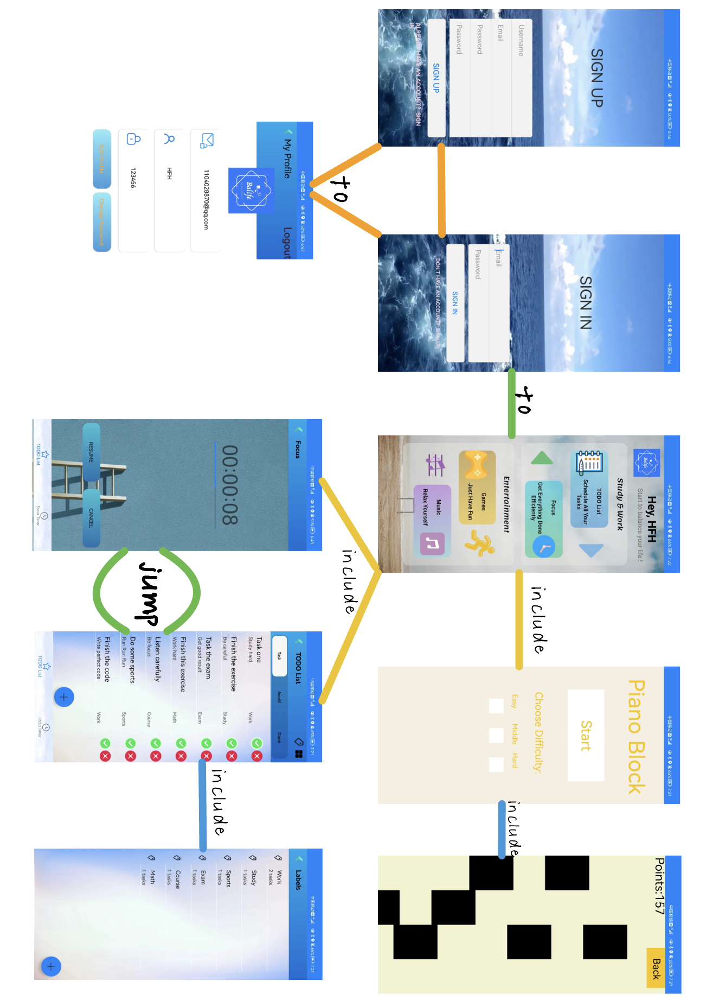
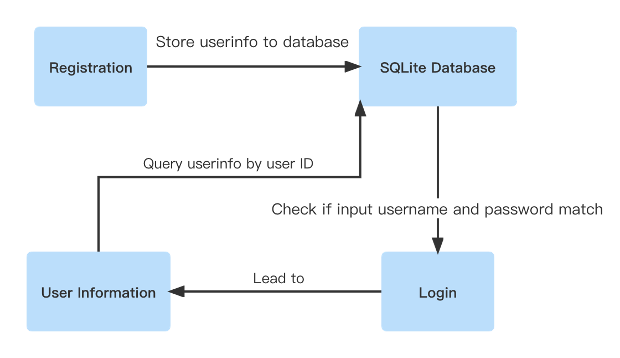
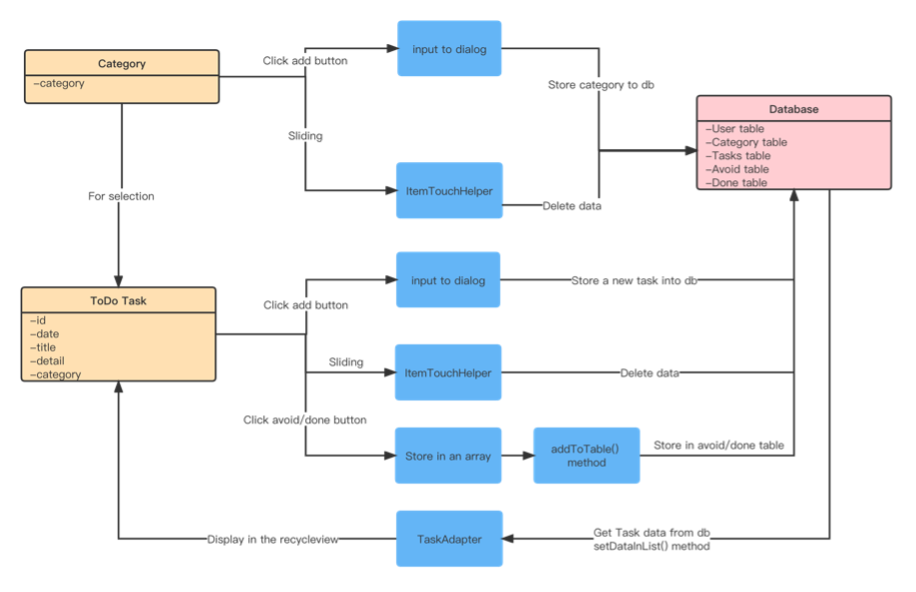
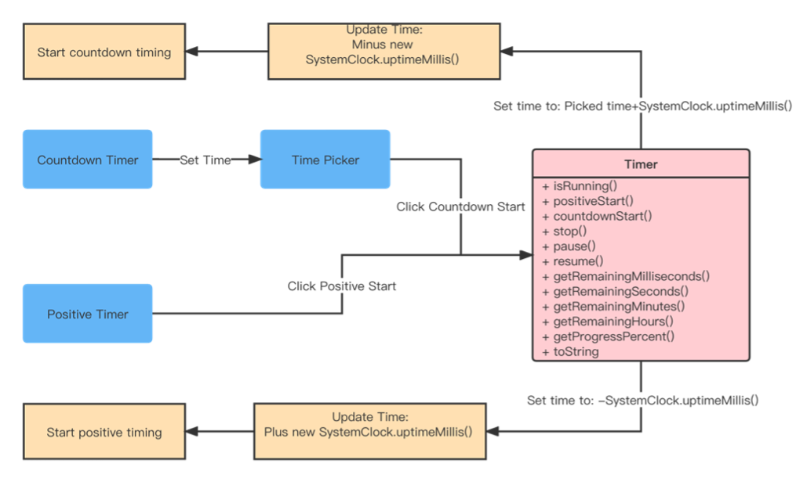
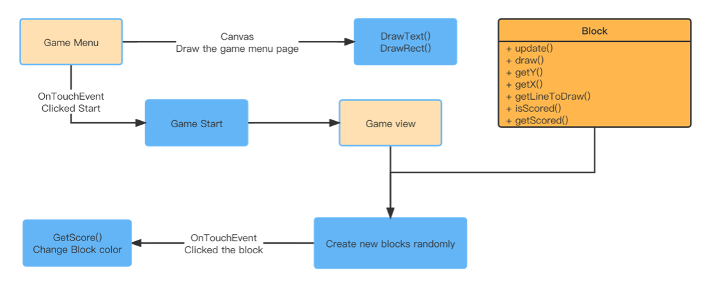

# Android-App-to-Help-WLB
Android app to help people balance their work and entertainment.

The project is finished after Alpha, beta and the final tests.

This android project aimed at creating an app named Balife which means balance your life for people who want to study and work regularly while having a moderate amount of fun to help them balance their life more regularly. This is the project UI flow chart.

###**Technology**
Programming Language: Java Database Choice: SQLite\
Libraries & API that may be used:\
1.Baidu OCR AP\
2.implementation ’com.github.PhilJay:MPAndroidChart:v3.1.0’ (create statistics chart) 3.implementation ’com.google.android.material:material:1.3.0’ (beautify UI)

###**User Management**
SQLite was chosen as the database where the information registered by the user will be stored and presented in the My Profile interface, where the user can change the information as well as the password. The structure diagram shows the logical implementation of the algorithm for this part.

###**TODO List**
As this algorithm structure flowchart shows, the user can create multiple categories of tasks and select the category it belongs to when creating a new task. The user can enter the title of the task, and a detailed description and display it in the interface of the recycle view via the adapter. Both the task and the category support a swipe to the side to delete an entry. The user can mark a task as avoided or done by clicking on the check mark and crossing to the right of the to-do task.

###**Focus Timer**
The timer provides both positive and countdown timers, with the additional positive timer giving the user constant positive feedback to promote their work and learning effectiveness. The system uses SystemClock.uptimeMillis() to get the time in milliseconds since the system was booted and implements the timer's positive and countdown timers by adding or subtracting the time when the new system is turned on, here is a detailed diagram of the algorithm implementation.

###**Game**
A small game called Piano Block is created using canvas drawing, where the player will click on a falling black piano block, after which the black block will turn white and the player's score will increase, and if the block is not clicked in time the player's score will decrease. The graph below shows the algorithm implementation.
